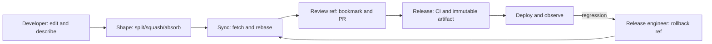
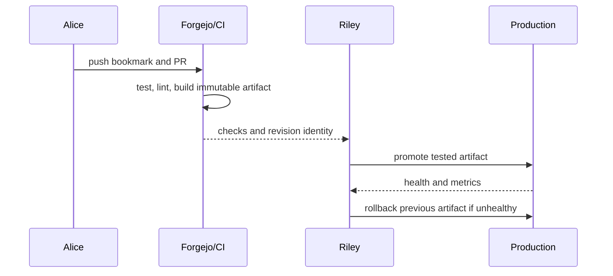

# Phase 2 — Learn jj by running the lab

## The learning game

This course uses the Feynman loop:

1. **Say it simply.** Read the short idea before the commands.
2. **Predict.** Write down what you expect `jj status`, `jj log`, or the graph
   to show.
3. **Run one experiment.** Copy the next block exactly.
4. **Inspect the evidence.** Compare your prediction with the output.
5. **Teach it back.** Explain the result in one sentence before moving on.

If your prediction is wrong, that is the useful part of the lesson. The lab is
disposable, so resetting and trying again is always safe.

## Two roles, one graph

You will play both roles throughout the same payment story:

- **Developer (Alice):** creates, reshapes, syncs, and repairs a change.
- **Release engineer (Riley):** reviews the Git-facing ref, runs CI, promotes
  the known revision, watches it, and rolls it back when needed.

Neither role gets a private mental model. Alice changes the jj graph; Riley
decides which graph position is safe to publish. After every experiment, both
roles answer the same four questions: what did we predict, what changed, why
did it change, and how would we explain it to a teammate?



Use this rhythm at each section:

1. **Developer predicts** the next working-copy and graph state.
2. **Run one command block** and save the evidence.
3. **Release engineer predicts** what a reviewer or deployment system can see.
4. **Explain plainly**, then teach the result back in one sentence per role.

## The recommended default playbook

Use this as the short answer after finishing the course. It favors the fewest
state changes needed for the situation:

| Situation | Reach for first | Why |
| --- | --- | --- |
| Editing the current feature | Edit files, then `jj status` | The working copy is already `@`; there is no staging ceremony |
| Starting a separate task | `jj new -m "..."` | Leaves the current change available without hiding it |
| Returning to existing work | `jj edit <change-id>` | Selects the logical change directly |
| Making history reviewable | `jj split`, `jj squash`, `jj absorb`, then `jj describe` | Shape the graph after discovery instead of planning every commit upfront |
| Touching up one revision | `jj diffedit -r <change-id>` | Edit the selected revision without switching through branches |
| Finding a regression | `jj bisect run --range <range> -- <test>` | Let binary search reduce the number of revisions you inspect |
| Updating from teammates | `jj git fetch`, inspect, then `jj rebase` | Import remote movement before changing local ancestry |
| Publishing | Create/update a bookmark, then `jj git push` | Bookmarks are the Git-facing publication boundary |
| Recovering a local mistake | `jj op log`, then `jj undo` or `jj op restore` | Operations preserve a direct recovery path |

There is no single fastest command for every situation. The recommended habit
is to keep work visible in the graph, make one deliberate graph change at a
time, inspect before publishing, and use the operation log when uncertain.

Every block below is intended to be copied into the indicated terminal. The
commands use only the disposable repository created by the lab.

You are following Alice through one small payment feature. Each section asks a
question raised by the previous one: where does an edit live, how do we start
parallel work, where did the stash go, what happens when `main` moves, and how
does a reviewer understand repeated rewrites? By the end, the commands should
feel like one investigation rather than a list of unrelated tricks.

## 0. Start and inspect

**Mission:** Alice is preparing a payment feature. Before changing code, learn
where the experiment lives and how to inspect it without guessing.

Run on the host:

```sh
# Start or rebuild the isolated lab and its services.
./lab start
./lab scenario list
```

**Predict:** Which directory will contain Alice’s `.jj` directory? Which actor
will have a Git-only clone? Check your answer with `./lab state`.

Run the first verified experiment:

```sh
# Reset disposable fixtures while retaining evidence.
./lab reset --all
./lab scenario run working-copy
./lab xray
./lab compare
```

## 1. The working copy is `@`

The first surprise is useful: Alice edits a file before making a commit. If jj
already shows the edit in a revision, the natural next question is what `@`
means and whether the edit has a stable identity.

Open the disposable Alice workspace:

```sh
# Run these commands in order for this step.
./lab shell
cd "$(cat /lab/active)/alice"
jj status
jj log -r '@ | @-' --no-graph
```

Change a file and observe that jj snapshots it without `git add`:

```sh
# Change a fixture file, then inspect the resulting work.
printf 'mode=production\n' > app.conf
jj status
jj diff --git
```

**Teach back:** `@` is ____________________. The change ID is useful because
____________________.

## 2. One change can evolve; `new` starts another

The payment edit is still Alice’s current change. Now an urgent login fix
arrives. We will leave the payment change where it is, create a child change,
and later return to the payment change by identity.

Copy this block in the same shell:

**Predict:** After `jj new`, which file should belong to the login change, and
which file should still belong to payment? Find both changes in the graph before
reading the explanation below.

```sh
# Run jj commands inside Alice’s workspace.
jj describe -m 'Payment validation'

printf 'in progress\n' > payment.txt

PAYMENT=$(jj log -r @ --no-graph -T 'change_id')

jj new -m 'Login redirect'

printf 'fixed\n' > login.txt

jj status

jj edit "$PAYMENT"

jj status
jj log -r '::@' --no-graph
exit
```

Verify the same behavior from the harness:

```sh
# Run the named experiment and record its evidence.
./lab scenario run evolving-change
./lab scenario run new-vs-edit
./lab scenario run context-switch
```

**Teach back:** Why did Alice use `jj edit` instead of a stash or a branch
checkout?

## 3. Shape the change before review

The payment change now has a stable identity, but its contents may still be
poorly shaped. Real work often means separating a receipt change, folding a
small correction into its parent, or touching up one revision. jj treats these
as graph operations, so the reviewable story stays connected.

**The reviewer’s question:** If one change contains payment logic and receipt
output, would you prefer one large review or two small reviews? Predict which
command can separate them before running the experiments.

Run the verified mechanics from the host:

```sh
# Exercise focused change shaping on fresh, disposable fixtures.
./lab scenario run split
./lab scenario run squash
./lab scenario run absorb
./lab scenario run diffedit
```

What each operation means:

- `jj split` separates selected files or hunks from one change.
- `jj squash` folds the current child into its parent.
- `jj absorb` moves a focused follow-up into the closest mutable ancestor.
- `jj diffedit` opens a diff-editor boundary; the harness uses a no-op editor
  because the container intentionally has no VS Code process.

**Mini-challenge:** Explain the difference between `split` and `squash` using
only “move apart” and “pull together.” Then explain why `absorb` is useful when
you discover a correction after starting the next change.

The underlying repository story remains the same: a payment change is being
made easier to review, not four unrelated toy repositories.

## 4. Stash migration and maintenance

Git users often reach for a stash at this moment. First inspect the Git stash
view, then notice that jj already keeps the payment work as a named change, so
parking it means moving to another change rather than hiding a bundle of files.

Reopen Alice’s disposable workspace on the host before running the next
commands:

```sh
# Open the lab container and enter Alice’s generated workspace.
./lab shell
cd "$(cat /lab/active)/alice"
```

A Git stash can be inspected and applied, but it is not jj’s normal parking
mechanism:

**Predict:** Will `git stash list` contain Alice’s jj payment change? If not,
where has the work gone?

```sh
# Inspect the Git stash visible in the fixture.
git stash list
git stash show -p 'stash@{0}' 2>/dev/null || true
```

In jj, park work by naming the current change and moving to another change:

```sh
# Run jj commands inside Alice’s workspace.
jj new -m 'Temporary investigation'
jj log -r '::@' --no-graph
jj op log
jj undo
exit
```

Verify recovery and operation history:

```sh
# Run the named experiment and record its evidence.
./lab scenario run operation-history
./lab scenario run undo
```

**Teach back:** In jj, what is the replacement for “stash this so I can switch
tasks”? Answer with a graph operation, not a Git command.

### Read the operation history like a flight recorder

The commit graph tells you what exists. The operation log tells you what you
did to the repository. Use it when the result surprises you:

```sh
# List recent repository operations, newest first.
jj op log -n 8

# Show the patch made by the current operation.
jj op show -p @

# Undo only the latest local operation.
jj undo
```

For a larger recovery, copy an operation ID from `jj op log`, inspect that past
state, then restore it deliberately:

```sh
# Inspect an earlier state without changing the repository.
jj --at-op <operation-id> log -r '@ | @-'

# Restore the repository to that operation in a new operation.
jj op restore <operation-id>
```

`jj undo` is the quick “take back my last move.” `jj op restore` is the
explicit “make the repository look like that earlier checkpoint.” Neither can
undo a remote push; remote state needs its own deliberate correction.

## 5. Find the first bad change

Alice now has a history that is easy to reshape, but a test has started failing.
Instead of guessing which edit caused it, let jj test the history by binary
search.

**Predict:** The regression is introduced in the middle of a four-change
payment history. Will jj test every revision, or only the revisions needed to
narrow the search?

```sh
# Find the first revision containing the payment regression.
./lab scenario run bisect
```

**Teach back:** `jj bisect` needs a range, a test command, and a rule that lets
it classify revisions as good or bad. The test exits `0` for good and non-zero
for bad.

## 6. Graph rewriting, sync, and conflicts

Alice’s local graph is now useful, but `main` belongs to other people. The next
question is whether fetching changes Alice’s work, and what happens when she
chooses to rebase. The conflict experiments then make the uncomfortable cases
visible instead of leaving them as folklore.

**Prediction game:** Fetching and rebasing sound like one action in everyday
Git speech. Predict which scenario changes Alice’s ancestry and which only
imports someone else’s movement.

Run the verified progression in order:

```sh
# Run the named experiment and record its evidence.
./lab scenario run descendant-rewrite
./lab scenario run remote-update
./lab scenario run rebase
./lab scenario run push-safety
./lab conflict run text-same-line
./lab conflict run partial-resolution
./lab conflict run stacked
```

Inspect any result without guessing from terminal text:

```sh
# Inspect the most recent recorded experiment.
./lab evidence show
./lab xray
./lab why
```

The key distinction is explicit: `jj git fetch` imports remote state; `jj
rebase` changes local ancestry; `jj git push` publishes a bookmark.

**Teach back:** Say the three verbs in order for a safe update: ________,
________, and ________. Then say which one can change the local graph.

## 7. Workspaces and hosted review

One directory is enough for one person, but parallel work needs more than one
place to stand. Workspaces provide that place while the graph remains shared.
Then we publish the payment feature and watch the same logical change survive a
remote update and a review cycle.

**The final test:** Can two people, or two agents, work at once without hiding
one person’s changes? Predict what a second workspace shares and what it keeps
separate.

Workspaces provide simultaneous directories; changes provide logical history:

```sh
# Run the named experiment and record its evidence.
./lab scenario run workspace
./lab scenario run review-evolution
```

The complete hosted flow is:

```sh
# Inspect or run the local Forgejo-backed workflow.
./lab forge doctor
./lab forge run
./lab forge status
```

The run creates a fresh repository, opens a PR, receives a main-branch update,
rebases and repushes the same PR, records Bob’s approval, merges, and verifies
what a Git-only clone receives.

**Developer challenge:** The PR head commit changes after the rebase. Does the
review disappear, or does the same logical change move?

**Release-engineer challenge:** Which stable ref does Forgejo consume, and
which check proves that the merged revision is the one a Git-only clone gets?

Use the Forgejo page and recorded evidence to teach both answers back.

Before deploying, follow [Selective push](docs/09-selective-push.md) to publish
only the ready payment fix while its unfinished receipt child stays local.

## 8. Deployment: promote a known revision, not a working directory

The developer has finished the payment change. Riley now treats the review
commit as an input to a release pipeline. The question is no longer “does my
directory look right?” but “which immutable revision did we test and promote?”

**Developer prediction:** After `jj bookmark set`, what object will Forgejo and
CI receive? **Release prediction:** If a later local edit is made, can the
already-built artifact change without a new revision?

Run the complete rehearsal from the host:

```sh
# Start Forgejo, run all local gates, then exercise the hosted review path.
./lab start
./lab check
./lab forge run
```

For a real deployment, Riley records the tested revision, builds one immutable
artifact, promotes that artifact through staging, and moves the release ref
only after health checks pass. A rollback moves the release ref back to the
last known-good revision; it does not use a stash.

### Lint is a CI gate, not a pre-commit ceremony

Alice may run lint before opening the PR, but the authoritative check belongs
to CI. This keeps the local jj workflow fast and makes the release decision
reproducible on a clean checkout.

```sh
# Run the pinned linter manually; this repository installs no pre-commit hook.
docker compose run --rm -T --entrypoint uv lab run --locked ruff check .
```

```yaml
# .github/workflows/ci.yml: every push and PR runs the same linter.
- name: Lint
  run: docker compose run --rm -T --entrypoint uv lab run --locked ruff check .
```

Riley’s deployment job depends on the quality job. If lint fails, no artifact
is promoted. **Teach back:** Alice says “I can run lint when I choose”; Riley
says “CI prevents an unlinted revision from reaching deployment.”



**Developer teach-back:** “My code is published through a bookmark pointing
to ______.”

**Release-engineer teach-back:** “The deployed artifact came from revision
______ and rollback means ______.”

## Completion check

Run the entire Phase 1 evidence set after finishing the path:

```sh
# Run the named experiment and record its evidence.
./lab scenario verify
./lab check
```

The expected result is 44 core scenarios passing, plus the separate Forgejo
scenario passing when `./lab forge run` is included.

## Final teach-back

Close the terminal and explain the journey to someone who has only used Git:

> “In jj, my current work is __________. I move between pieces of work with
> __________. I shape history with __________. I bring remote work in with
> __________, change ancestry with __________, and publish through
> __________. If I make a mistake, I inspect __________ or run __________.”

If you can fill that in without looking at the command list, you have learned
the jj mindset rather than memorized a recipe.

The release-engineer version is:

> “I review the bookmark ______, verify CI for revision ______, promote the
> immutable artifact ______, observe ______, and roll back by moving ______.”
