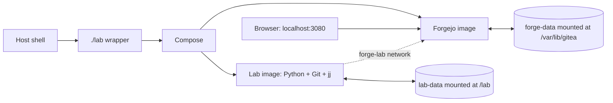

# System map

## Component responsibilities

| Component | Responsibility | Source |
| --- | --- | --- |
| `./lab` | Select Docker/Podman, build images, start services, and forward commands | [`lab`](../lab) |
| `compose.yaml` | Define the isolated lab container and `lab-data` volume | [`compose.yaml`](../compose.yaml) |
| `compose.forgejo.yaml` | Add Forgejo, the Forgejo client container, networks, port `3080`, and `forge-data` | [`compose.forgejo.yaml`](../compose.forgejo.yaml) |
| `Dockerfile` | Pin Python, uv, Git, jj, dependencies, and runtime environment | [`Dockerfile`](../Dockerfile) |
| `Dockerfile.forgejo` | Pin Forgejo and install the account initializer | [`Dockerfile.forgejo`](../Dockerfile.forgejo) |
| `src/jj_lab/cli.py` | User-facing commands and orchestration | [`cli.py`](../src/jj_lab/cli.py) |
| `src/jj_lab/repos/factory.py` | Create Alice/Bob/Carol repositories and the local bare origin | [`factory.py`](../src/jj_lab/repos/factory.py) |
| `src/jj_lab/scenarios/` | Define the arrange/act/observe/assert experiments | [`scenarios`](../src/jj_lab/scenarios) |
| `src/jj_lab/evidence/` | Serialize commands, snapshots, assertions, and reports | [`evidence`](../src/jj_lab/evidence) |
| `src/jj_lab/forge/` | Restrict and execute the hosted Forgejo workflow | [`forge`](../src/jj_lab/forge) |

## Process boundaries

The host runs only the small shell wrapper and the Compose client. The Python
harness runs inside the pinned `jj-confidence-lab:local` image. Forgejo runs in
a separate rootless image. This separation means:

- host Git/jj configuration is not inherited;
- the lab container cannot access the network;
- Forgejo is reachable only through its internal `forge-lab` network and the
  browser-facing `127.0.0.1:3080` mapping;
- fixture and evidence files live under `/lab`, not in the source checkout.

## Remote topology

The component boundary is shown in [system-map.mmd](diagrams/system-map.mmd):



Each core scenario creates a new topology:

```text
                    file:// local transport
        ┌──────────────────────────────────────┐
        │ /lab/runs/<scenario>/<run>/origin.git│  bare Git origin
        └───────────────┬──────────────────────┘
             clone     │ push/fetch
       ┌───────────────┴───────────────┐
       │                               │
 Alice: jj git clone --colocate     Bob: Git clone
       │                               │
       └───────────────┬───────────────┘
                       │
                 Carol: Git clone
```

The Forgejo experiment adds a separate HTTP remote named `forgejo`. It still
keeps the local bare `origin` as a visible control remote.
