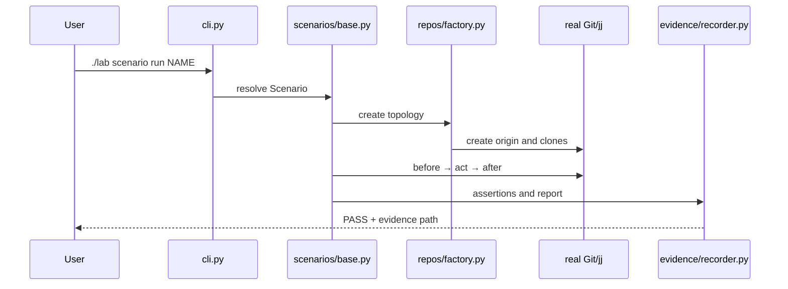

# Runtime lifecycle

## First run: `./lab start`

The wrapper performs these steps in order:

1. Select `docker` (or `podman` when `LAB_RUNTIME=podman`).
2. Check that the runtime and its Compose provider respond.
3. Build the lab and Forgejo images from [`Dockerfile`](../Dockerfile) and
   [`Dockerfile.forgejo`](../Dockerfile.forgejo).
4. Start Forgejo and wait for its health check.
5. Run `forge doctor` in the `forge-lab` client container.
6. Run `lab start` in the lab container. The CLI runs its doctor checks and
   creates `/lab/interactive` if there is no active fixture.

The wrapper is in [`lab`](../lab); the CLI command is in
[`src/jj_lab/cli.py`](../src/jj_lab/cli.py).

Commands beginning with `./lab` or `make` run on the host. Commands such as
`jj`, `git`, and file edits in the tutorial run inside `./lab shell` after
entering `/lab/active/alice`. Type `exit` to return to the host.

## A core scenario: `./lab scenario run NAME`

The command flow is shown in [core-scenario.mmd](diagrams/core-scenario.mmd):

Every scenario follows one explicit lifecycle implemented by
[`scenarios/base.py`](../src/jj_lab/scenarios/base.py):

1. **Arrange** — create an isolated run directory, bare origin, seeded Bob
   Git clone, colocated Alice jj clone, and Carol Git clone.
2. **Before snapshot** — run `jj status` first, then collect Git/jj state.
3. **Act** — execute the scenario's operation, such as `jj rebase` or
   `jj undo`.
4. **Observe** — capture the after-state and any named checkpoints.
5. **Assert** — evaluate semantic assertions against the before/after states.
6. **Report** — write JSONL command records, snapshots, normalized text,
   assertions, and `summary.md` under `/lab/artifacts/evidence`.

The command runner records the executable, arguments, working directory,
sanitized environment, output, exit code, duration, and lifecycle phase. See
[`core/command.py`](../src/jj_lab/core/command.py).

## Forgejo workflow: `./lab forge run`

The hosted workflow is separate from the 44 core scenarios. It runs in this
order:

1. Check Forgejo version and the `alice`/`bob` accounts.
2. Create a fresh `lab-*` repository through the local API.
3. Add the `forgejo` remote and push `main`.
4. Create a jj feature bookmark, push it, and open a real PR.
5. Bob pushes an urgent `main` update.
6. Alice fetches, rebases the jj change onto `main@forgejo`, and pushes the
   rewritten feature bookmark.
7. The same PR observes the new head; Bob approves and merges it.
8. Alice and Bob fetch again; the scenario verifies both merged files.

The implementation is [`forge/scenario.py`](../src/jj_lab/forge/scenario.py).

## Why `./lab check` takes longer

`./lab check` runs formatting, linting, ShellCheck, unit tests, integration
tests, every registered core scenario, and doctor checks. It does not require
Forgejo for the core gate. Run `./lab forge run` separately for the hosted PR
path.
