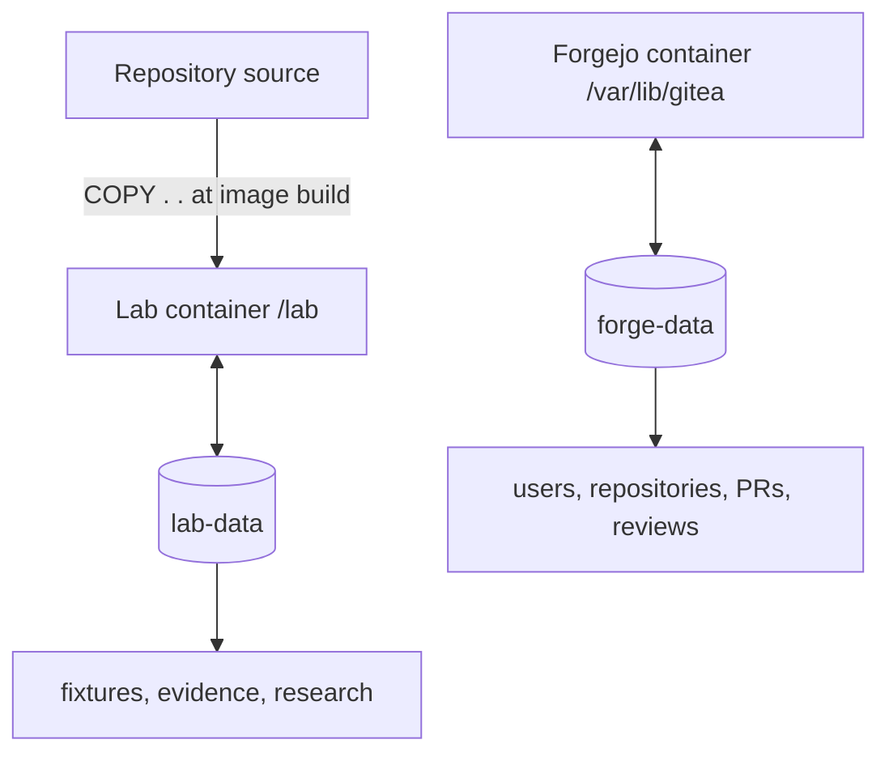

# Storage and volumes

## What is persistent

The persistence boundary is shown in [storage.mmd](diagrams/storage.mmd):



| Storage | Container path | Compose volume | Contents | Reset by `./lab reset --all`? |
| --- | --- | --- | --- | --- |
| Lab state | `/lab` | `lab-data` | interactive fixture, scenario runs, checkpoints, evidence, generated reports, lab home/config | No; repositories are removed, evidence remains |
| Forgejo state | `/var/lib/gitea` | `forge-data` | Forgejo SQLite database, users, repositories, PRs, reviews, server config | No |

The exact Docker names normally include the Compose project, for example
`jj-git_lab-data` and `jj-git_forge-data`. The name is not hard-coded in the
application; inspect it instead of assuming it.

## Find the volume and host mountpoint

```sh
# Inspect or export container state.
docker compose -f compose.yaml -f compose.forgejo.yaml config --volumes
docker volume ls
docker volume inspect jj-git_lab-data
docker volume inspect jj-git_forge-data
```

Look for the `Mountpoint` field. On a typical Linux Docker Engine it is under
`/var/lib/docker/volumes/.../_data`. Docker Desktop on macOS stores that path
inside its VM, so use `docker run` or Compose to inspect files rather than
assuming the path is directly visible on macOS.

## Inspect without guessing the host path

```sh
# Inspect or export container state.
docker compose run --rm -T --entrypoint sh lab -lc \
  'find /lab -maxdepth 3 -type d | sort | sed -n "1,120p"'

docker compose -f compose.yaml -f compose.forgejo.yaml run --rm -T \
  --entrypoint sh forge-lab -lc \
  'find /lab/artifacts/evidence -maxdepth 3 -type f | sort | tail -40'
```

Forgejo data is intentionally inspected through the volume metadata or the
Forgejo UI/API; do not edit its SQLite files while the server is running.

## Reset and delete semantics

- `./lab reset` replaces only `/lab/interactive`; evidence remains.
- `./lab reset --all` removes owned scenario fixture directories under
  `/lab/runs`; evidence remains.
- `./lab forge stop` stops Forgejo but keeps `forge-data` and PR history.
- `docker compose down` stops/removes containers but keeps named volumes.
- `docker compose down -v` deletes both named volumes. This is destructive to
  all lab evidence and Forgejo history; use it only when a full clean slate is
  intended.

## Export the lab volume

```sh
# Inspect or export container state.
docker compose run --rm -T --entrypoint tar lab \
  -C /lab -czf - artifacts research > artifacts/lab-evidence.tar.gz
```

This exports evidence and reports without mounting the Docker volume into the
host filesystem. Replace `docker` with `podman` when using Podman.
