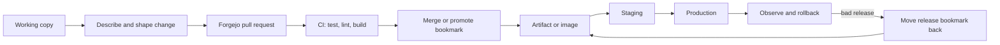

# Deployment workflow for a jj team

The lab's Forgejo server models code review and remote synchronization. It
does not deploy an application, so this guide makes the production boundary
explicit and gives the same repeatable sequence a real team would use.

Read every step twice: first as the developer who creates the revision, then as
the release engineer who must prove which revision is safe. Before running a
command, predict the ref or artifact it will produce; after running it, explain
the result in one plain sentence.



## Copy-and-run rehearsal

```sh
# Start the disposable Forgejo remote.
./lab start

# Run the full local quality gate and all 44 core scenarios.
./lab check

# Exercise fetch, rebase, push, and pull-request creation against Forgejo.
./lab forge run
```

**Developer teach-back:** “My change is reviewable because ______.”

**Release-engineer teach-back:** “The artifact is safe to promote because it
was built and checked from revision ______.”

## Lint without a pre-commit hook

Lint does not need to run on every keystroke or through a Git hook. The
developer can run it when ready, while CI enforces it on every push and pull
request. A failed lint job prevents the release job from receiving an artifact.

Developer check, from the repository root:

```sh
# Run the pinned Ruff linter in the lab image; no pre-commit hook is installed.
docker compose run --rm -T --entrypoint uv lab run --locked ruff check .
```

The repository already has the equivalent CI gate:

```yaml
# .github/workflows/ci.yml: lint is a required CI step, not a local hook.
- name: Lint
  run: docker compose run --rm -T --entrypoint uv lab run --locked ruff check .
```

The deployment dependency is deliberately visible:

```yaml
# A deployment job can run only after the quality job succeeds.
deploy:
  needs: quality
  if: ${{ needs.quality.result == 'success' }}
  steps:
    - run: ./scripts/promote-tested-artifact.sh
```

**Developer prediction:** lint reports errors before a review is published.
**Release prediction:** a failing lint job means no promotion step runs.

If you edit source code locally, rebuild the pinned image before using the
container command:

```sh
# Refresh the image so the linter sees the current checkout.
./lab start
```

For a real service, CI should build an immutable artifact from the review
commit, test that artifact, and attach the version to a release bookmark or
tag. A deployment job then promotes that exact artifact; it should not rebuild
from a moving working copy.

| Situation | jj action | Why |
| --- | --- | --- |
| Prepare a review | `jj describe`, `jj split`, `jj squash` | Keep one logical change per review unit |
| Sync before release | `jj git fetch`; inspect `jj log`; rebase | Import remote state before promotion |
| Publish review state | `jj bookmark set feature -r <change>`; `jj git push` | Forgejo sees a stable Git ref |
| Name a release | `jj tag set v1.2.3 -r <release-change>` | Make the deployed revision addressable |
| Roll back | Move the release bookmark or tag to the last known-good change and push | Rollback is a graph/ref decision |
| Recover a local mistake | `jj op log`, then `jj undo` or `jj op restore` | Restore before redeploying |

The pinned Forgejo compose file disables Forgejo Actions. The repository's
GitHub Actions workflow validates the harness itself; it is not a production
deployment pipeline. A real Forgejo runner should keep the same gates:
format, lint, unit/integration tests, scenario verification, and artifact
publication.

The harness proves reproducible history, review refs, remote sync, conflict
handling, and recovery. Your platform still owns secrets, registries,
environment configuration, migrations, rollout strategy, observability, and
approval policy.
